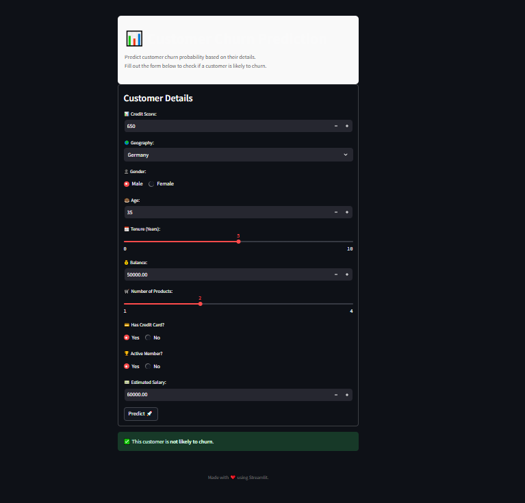

# Customer Churn Prediction App (Streamlit)

# Customer Churn Prediction
This project provides a Streamlit application for users to input customer-related features and receive churn predictions from a FastAPI backend.

## Table of Contents
- [Description](#description)
 - [Requirements](#requirements)
 - [Getting Started](#getting-started)
 - [Usage](#usage)
 - [Example Input and Output](#example-input-and-output)
 - [File Structure](#file-structure)
 - [License](#license)

## Description
The Streamlit application provides an interactive web interface for predicting customer churn based on user inputs. The prediction model is served by a FastAPI backend, which processes inputs such as:
- Credit Score
- Geography (France, Germany, Spain)
- Gender
- Age
- Tenure
- Balance
- Number of Products
- Credit Card Ownership
- Active Member Status
- Estimated Salary

The Streamlit app fetches metadata (labels and encoding) for geography and gender from the FastAPI backend and uses it to populate input fields dynamically.

## Requirements
To set up and run this project, you’ll need the following Python packages:
```
- scikit-learn
- pandas
- joblib
- numpy
- streamlit
- uvicorn
- python-dotenv
- requests
```
You can install these dependencies by running:
```commandline
pip install -r requirements.txt
```
## Getting Started
Follow these steps to set up and run the project.
1. Ensure the FastAPI server is running on http://127.0.0.1:8000
2. Declare the base_url to your API in the .env file e.g. BASE_URL=http://127.0.0.1:8000
3. Run Streamlit The Streamlit app allows users to input values and retrieve predictions from the FastAPI server. To start Streamlit, run:

```commandline
streamlit run app.py
```
The Streamlit app will open in a browser window at http://localhost:8501.

## Usage
Streamlit Frontend


- Input customer details in the provided fields.
- Click the Predict button to get the prediction.
- The prediction will display whether the customer is likely to churn or not.

## Streamlit Application

The Streamlit app provides an interface for users to input feature values and get churn predictions. When the Predict button is clicked, the app sends the data to the FastAPI server and displays whether the customer is likely to churn.

## Example Input and Output
Example Input:

Credit Score = 720
Geography = Germany
Gender = Male
Age = 45
Tenure = 5 years
Balance = 75,000
Number of Products = 2
Has Credit Card = Yes
Active Member = No
Estimated Salary = 60,000

Example Output:

This customer is likely to churn.

## File Structure

The project directory is structured as follows:
```commandline
📦 XGBoostRegressorFrontend
├─ src
├─ .env
├─ .gitignore
├─ app.py
├─ README.md
└─ requirements.txt
```-
## License
This project is licensed under [